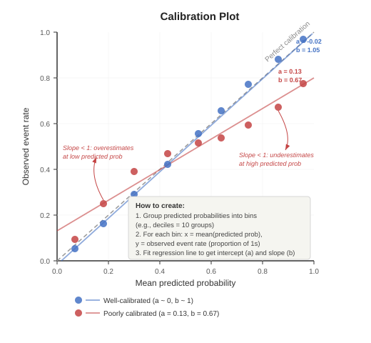

# Evaluating Machine Learning (ML) Prediction Models

**Herdiantri Sufriyana**
Graduate Institute of Artificial Intelligence and Big Data in Healthcare
National Taiwan University of Nursing and Health Sciences

---

## Subtopics

- Evaluating calibration
- Choosing an optimal threshold
- Evaluating discrimination using confusion matrix and ROC curve
- Evaluating clinical utility using decision curve analysis

---

## ML Workflow (Review)

> **Can you guess:**
>
> - Which PROBAST+AI signaling questions address model evaluation?
> - At which step(s) in the ML workflow do we evaluate the model?

*Hint: Think about the signaling questions you reviewed in Week 2 and the ML workflow steps from Week 1.*

---

## Session 1: Lecture — Calibration (15 mins)

---

## What is Calibration?

A model is **calibrated** when predicted probabilities match observed frequencies.

- If the model predicts 30% probability of the event, approximately 30 out of 100 such patients should actually have the event
- **Calibration plot:** predicted probabilities (x-axis) vs. observed frequencies (y-axis)
  - Perfect calibration = 45-degree diagonal line
  - Above the line = model underestimates risk
  - Below the line = model overestimates risk

**Calibration metrics:**

| Metric | What it measures | Ideal value |
|--------|-----------------|-------------|
| **Calibration intercept** | Systematic bias — whether predictions are consistently too high or too low | 0 (no bias) |
| **Calibration slope** | Whether the model correctly combines predictors | 1 (perfect) |
| **Brier score (= MSE)** | Mean squared error between predicted probability and actual outcome | 0 (perfect) |
| **RMSE** | Root mean squared error of predicted vs. observed | 0 (perfect) |
| **MAE** | Mean absolute error of predicted vs. observed | 0 (perfect) |

**Calibration intercept and slope** are obtained by fitting a logistic regression of the actual outcome on the logit of predicted probabilities:

$$\text{logit}(Y) = a + b \cdot \text{logit}(\hat{p})$$

| Parameter | Meaning | Interpretation |
|-----------|---------|----------------|
| **a (intercept)** | Systematic shift | a > 0 → model underestimates; a < 0 → model overestimates |
| **b (slope)** | Predictor combination | b < 1 → underestimates risk at low predicted probability, overestimates risk at high predicted probability; b > 1 → the opposite |

> **Can you guess:**
>
> - From Meeting 09, which algorithms tend to produce well-calibrated probabilities?
> - Why might a random forest be poorly calibrated even if its AUC is high?
> - *(Hint: think about how random forests estimate probabilities — proportion of trees voting for each class)*

---

## Calibration Plot

**How to create a calibration plot:**

1. Divide predicted probabilities into groups (e.g., deciles — 10 groups)
2. For each group, compute the mean predicted probability (x) and the observed event rate (y)
3. Plot (x, y) and compare to the 45-degree diagonal (perfect calibration line)

> **Can you guess:**
>
> - If all points lie above the diagonal, is the model over- or under-estimating risk?
> - How many groups should you use if you have very few events?

---

## Session 2: Hands-on — Calibration (10 mins)

**Task:** Create a calibration plot comparing all trained models.

**Steps:**
1. Open the Meeting 11 Orange workflow (with Test and Score connected to 7 learners)
2. Connect **Test and Score → Calibration Plot** (label it "Calibration plot") via **Evaluation Results → Evaluation Results**
3. In the Calibration Plot widget, compare all algorithms against the diagonal
4. Identify which model is best calibrated (closest to the diagonal)

**Orange environment** — Continuing from Meeting 11 workflow

---

## Session 3: Lecture — Threshold (10 mins)

---

## Choosing an Optimal Threshold

**Why the default 0.5 threshold is often wrong:**
- The optimal threshold depends on the clinical context — the relative costs of false positives vs. false negatives
- Use the **cost-aware threshold**

**Cost-aware threshold** (Wynants et al., 2019, BMC Med):

$$p_t = \frac{C_{FP} - C_{TN}}{C_{FP} - C_{TN} + C_{FN} - C_{TP}}$$

| Cost | Meaning | Example |
|------|---------|---------|
| $C_{FP}$ | Cost of false alarm (false positive) | Unnecessary testing, patient anxiety |
| $C_{TN}$ | Cost of applying the risk model (true negative) | Screening cost per patient |
| $C_{FN}$ | Cost of missed disease (false negative) | Death, disability, disease progression |
| $C_{TP}$ | Cost of detected disease (true positive) | Intervention cost + treatment burden |

**Intuition:**
- If $C_{FN}$ is much larger than $C_{FP}$ (missing disease is very costly), the threshold decreases → model catches more positives (favors sensitivity)
- If $C_{FP}$ is much larger than $C_{FN}$ (false alarms are very costly), the threshold increases → model is more selective (favors specificity)

**Example:** Screening for autism in children (Sufriyana et al., 2025)
- $C_{FP}$ = 20 (unnecessary referral), $C_{TN}$ = 7 (screening cost), $C_{FN}$ = 95 (missed diagnosis), $C_{TP}$ = 45 (early intervention)
- $p_t$ = (20 − 7) / (20 − 7 + 95 − 45) = 13 / 63 = **0.21** — a low threshold because missing a case is far more costly than a false alarm

**Youden's J statistic** (an alternative when costs are unknown):

$$J = \text{Sensitivity} + \text{Specificity} - 1$$

- The threshold that maximizes J balances sensitivity and specificity
- Visualized as the point on the ROC curve **farthest from the diagonal** (we will see this in Session 9)

> Wynants L, van Smeden M, McLernon DJ, Timmerman D, Steyerberg EW, Van Calster B. Three myths about risk thresholds for prediction models. BMC Med. 2019;17(1):192. doi:10.1186/s12916-019-1425-3

> **Can you guess:**
>
> - For a screening test, would you prefer a higher or lower threshold?
> - For a confirmatory test, would you prefer a higher or lower threshold?
> - Using the cost-aware formula, what happens to $p_t$ if $C_{FN}$ = $C_{FP}$?

---

## Session 4: Hands-on — Threshold (10 mins)

**Task:** Determine the cost-aware threshold for your clinical scenario.

**Steps:**
1. Drag a **File** widget (label it "Costs of outcome") → load a CSV with one row and four columns: `cfp`, `ctn`, `cfn`, `ctp` containing your cost values
2. Connect **Costs of outcome → Formula** (label it "Compute cost-aware threshold") — create a new numeric variable:
   `threshold := (cfp-ctn)/(cfp-ctn+cfn-ctp)`
3. Connect **Compute cost-aware threshold → Data Table** (label it "Threshold") — read the computed threshold value
4. Record your threshold — you will use it in the following sessions

**Orange environment** — Continuing from Session 2

---

## Session 5: Lecture — Confusion Matrix (10 mins)

---

## What is a Confusion Matrix?

A confusion matrix summarizes **all prediction outcomes** at a given threshold:

|  | Predicted Positive | Predicted Negative |
|--|-------------------|--------------------|
| **Actual Positive** | True Positive (TP) | False Negative (FN) |
| **Actual Negative** | False Positive (FP) | True Negative (TN) |

**Threshold-dependent metrics derived from these four cells:**

| Metric | Formula | Meaning |
|--------|---------|---------|
| **Sensitivity (Recall)** | TP / (TP + FN) | How well the model catches positives |
| **Specificity** | TN / (TN + FP) | How well the model identifies negatives |
| **PPV (Precision)** | TP / (TP + FP) | Among predicted positives, how many are truly positive |
| **NPV** | TN / (TN + FN) | Among predicted negatives, how many are truly negative |
| **F1 score** | 2 × (PPV × Sensitivity) / (PPV + Sensitivity) = 2TP / (2TP + FP + FN) | Harmonic mean of precision and recall |
| **Accuracy** | (TP + TN) / (TP + FP + FN + TN) | Overall proportion of correct predictions |
| **MCC** | See below | Balanced measure even for imbalanced classes |

**Matthews correlation coefficient (MCC):**

$$\text{MCC} = \frac{TP \cdot TN - FP \cdot FN}{\sqrt{(TP+FP)(TP+FN)(TN+FP)(TN+FN)}}$$

- Ranges from −1 (perfect inverse) to +1 (perfect prediction)
- Unlike accuracy, MCC is informative even when classes are highly imbalanced

> **Can you guess:**
>
> - If you lower the threshold, which cells increase and which decrease?
> - *(Hint: more patients are predicted positive → TP and FP both increase, FN decreases)*
> - Why might accuracy be misleading for a dataset with 95% negatives?
> - *(Hint: a model that always predicts negative gets 95% accuracy)*

---

## Session 6: Hands-on — Stack Models and Compute Predictions (15 mins)

**Task:** Prepare stacked predictions at your cost-aware threshold.

**Steps:**
1. Connect **Test and Score → Select Columns** (label it "Predicted probabilities") via **Predictions → Data** — move all predicted probability columns to Features, move `id` to Meta
2. Connect **Predicted probabilities → Melt** (label it "Stack models") — set Unique Row Identifier to `id`, check Ignore non-numeric features
3. Connect **Stack models → Formula** (label it "Compute predictions") — create a new numeric variable using the threshold from Session 4 (replace 0.21 with your value):
   `prediction := (value >= 0.21) * 1`
4. Connect **Compute predictions → Data Table** (label it "Predictions") — verify that `prediction` column shows 0 or 1 for every row

**Orange environment** — Continuing from Session 4

---

## Session 7: Hands-on — Add Outcome (15 mins)

**Task:** Merge the actual outcome with the stacked predictions.

**Steps:**
1. Connect **Test and Score → Select Columns** (label it "Outcomes") via **Predictions → Data** — move only `outcome` to Features, move `id` to Meta
2. Connect **Outcomes → Formula** (label it "Convert outcome") — convert categorical outcome to numeric:
   `observation := (outcome == "1") * 1` (replace "1" with the positive class label in your data)
3. Connect **Predictions → Merge Data** (label it "Add outcome") via **Selected Data → Data**, and connect **Convert outcome → Merge Data** via **Data → Extra Data** — select "Find matching pairs of rows", change Row matching to **`id` matches `id`**
4. Verify in a Data Table that every row has both `prediction` and `observation` values (not "?")

**Orange environment** — Continuing from Session 6

---

## Session 8: Hands-on — Compute Confusion Matrix and Metrics (15 mins)

**Task:** Compute TP/FP/FN/TN per model and derive discrimination metrics.

**Steps:**
1. Connect **Add outcome → Formula** (label it "Compute confusion matrix") — create four numeric variables:
   - `TP := prediction * observation`
   - `FP := prediction * (1 - observation)`
   - `FN := (1 - prediction) * observation`
   - `TN := (1 - prediction) * (1 - observation)`
2. Connect **Compute confusion matrix → Group By** (label it "Group by model") — group by `item` (model name), compute: sum of TP, sum of FP, sum of FN, sum of TN
3. Connect **Group by model → Formula** (label it "Compute discrimination metrics") — compute:
   - `accuracy := (TP + TN) / (TP + FP + FN + TN)`
   - `sensitivity := TP / (TP + FN)`
   - `specificity := TN / (TN + FP)`
   - `precision := TP / (TP + FP)`
   - `npv := TN / (TN + FN)`
   - `f1 := 2 * TP / (2 * TP + FP + FN)`
   - `mcc := (TP * TN - FP * FN) / sqrt((TP+FP) * (TP+FN) * (TN+FP) * (TN+FN))`
4. Connect **Compute discrimination metrics → Data Table** (label it "Confusion matrix") — compare TP, FP, FN, TN and all metrics across models

**Orange environment** — Continuing from Session 7

---

## Session 9: Lecture — Discrimination (10 mins)

---

## What is Discrimination?

Discrimination is the model's ability to **separate** patients with and without the outcome across **all possible thresholds**.

**Threshold-independent metrics:**

| Metric | What it measures |
|--------|-----------------|
| **AUC-ROC** | Area under the receiver operating characteristic curve — overall separation |
| **AUC-PRC** | Area under the precision-recall curve — useful for imbalanced data |

**ROC curve:** plots sensitivity (y) vs. 1 − specificity (x) at every threshold — now you know what these mean from Session 5.

**PRC curve:** plots precision/PPV (y) vs. recall/sensitivity (x) at every threshold.

---

## ROC Curve

---

## Precision-Recall Curve

---

## Session 10: Hands-on — Discrimination (10 mins)

**Task:** Compare discrimination ability of all models using ROC analysis, and locate your cost-aware threshold on the curve.

**Steps:**
1. Connect **5-fold cross-validation → ROC Analysis** (label it "ROC curve") via **Evaluation Results → Evaluation Results**
2. In the ROC curve widget, view the ROC curves for all algorithms
3. Compare AUC values — identify the best-discriminating model
4. Note which algorithms have curves close to the diagonal (poor) vs. upper-left corner (good)
5. Click on the ROC curve to move the threshold point to your cost-aware $p_t$ from Session 4 — note the sensitivity and specificity
6. Compare to Youden's J (the point farthest from the diagonal) — is your cost-aware threshold higher or lower? Why?

**Orange environment** — Continuing from Session 8

---

## Session 11: Lecture — Clinical Utility (10 mins)

---

## What is Clinical Utility?

Clinical utility measures whether using the model **improves clinical decisions** compared to treating all or treating none.

**Decision curve analysis (DCA):**
- Plots **net benefit** against a range of **threshold probabilities**
- Net benefit = true positives (weighted) minus false positives (weighted by threshold)

$$\text{Net benefit} = \frac{TP}{N} - \frac{FP}{N} \cdot \frac{p_t}{1 - p_t}$$

Where $p_t$ = threshold probability (the probability above which you would treat). Now you know what TP and FP mean from Session 5.

**Interpretation:**
- Compare the model's net benefit curve to two reference strategies:
  - **Treat all** = assume everyone is positive
  - **Treat none** = assume everyone is negative (net benefit = 0)
- A useful model has net benefit **above both references** across clinically relevant thresholds

**Determining the reference strategies:**

| Strategy | Intercept (at $p_t$ = 0) | Slope | Reaches NB = 0 at |
|----------|-------------------------|-------|-------------------|
| **Treat none** | NB = 0 always | Flat (horizontal line at 0) | Always at 0 |
| **Treat all** | NB = prevalence | Decreases as $p_t$ increases | $p_t$ = prevalence |

- **Treat none:** No one is treated → TP = 0, FP = 0 → NB = 0 for every threshold
- **Treat all:** Everyone is predicted positive → TP = all positives, FP = all negatives. At $p_t$ = 0, NB = prevalence (the event rate). As $p_t$ increases, the cost of false positives grows, and NB decreases. NB crosses 0 when $p_t$ equals the prevalence — beyond this, treating everyone costs more than it benefits

> **Can you guess:**
>
> - At which threshold probability does "treat all" have net benefit = 0?
> - Why is a model with AUC = 0.90 not necessarily clinically useful?
> - *(Hint: if the model's net benefit never exceeds "treat all," the model does not add value for decision-making)*

---

## Decision Curve

---

## Session 12: Hands-on — Build Parallel Chain for Treat All and Treat None (10 mins)

**Task:** Add treat-all and treat-none reference models alongside the 7 trained models.

**Steps:**
1. Drag a **Formula** widget (label it "Add treat-all and treat-none") — add two constant columns:
   - `Treat all := 1.0`
   - `Treat none := 0.0`
2. Copy and paste the widgets from Sessions 6–7 as a parallel path with "(1)" suffix. Connect them in the same order:
   **Add treat-all and treat-none → Predicted probabilities (1) → Stack models (1) → Compute predictions (1) → Predictions (1)**, and **Convert outcome** (from Session 7) **→ Add outcome (1)** via **Data → Extra Data**, **Predictions (1) → Add outcome (1)** via **Selected Data → Data**
3. Connect **Add outcome** (from Session 7) and **Add outcome (1)** → **Concatenate** (label it "Concatenate model and treat") via **Data → Additional Data** — this combines the 7-model rows with the 2-reference rows

**Orange environment** — Continuing from Session 10

---

## Session 13: Hands-on — Compute Net Benefits (10 mins)

**Task:** Compute net benefits and compare clinical utility across all models.

**Steps:**
1. Connect **Concatenate model and treat → Formula** (label it "Compute confusion matrix (1)") — same formulas as Session 8 step 1
2. Connect **Compute confusion matrix (1) → Group By** (label it "Group by model (1)") — same settings as Session 8 step 2
3. Connect **Group by model (1) → Formula** (label it "Compute n") — compute:
   `n := TP + FP + FN + TN`
4. Connect **Compute n → Formula** (label it "Compute net benefits") — compute (replace 0.21 with your threshold):
   `nb := TP / n - FP / n * 0.21 / (1 - 0.21)`
5. Connect **Compute net benefits → Data Table** (label it "Net benefits") — compare `nb` across all 9 rows
6. For each model, check whether its `nb` > Treat all's `nb` and > Treat none's `nb` (= 0) — a model is clinically useful only when it exceeds both

**Connect to your capstone study plan:**
This analysis informs the "model evaluation" section. Students should take notes of any changes from the study plan in the assignment.

**Orange environment** — Continuing from Session 12

---

## Take-home Message

1. **Calibration** measures whether predicted probabilities are accurate — use the calibration plot and Brier score to assess and compare models
2. **Threshold** selection balances clinical costs — use the cost-aware formula to choose an optimal cutoff, or Youden's J when costs are unknown
3. **Confusion matrix** provides threshold-dependent metrics (sensitivity, specificity, precision, NPV, F1, accuracy, MCC) — understanding TP/FP/FN/TN is the foundation for all evaluation
4. **Discrimination** measures separation ability across all thresholds — use AUC-ROC (sensitivity vs. 1−specificity) and AUC-PRC (precision vs. recall)
5. **Clinical utility** measures whether the model improves decisions — use decision curve analysis (net benefit from TP and FP) to compare against treat-all and treat-none strategies
