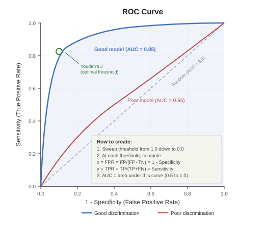
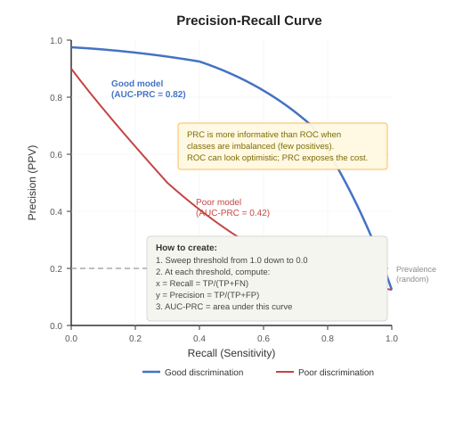
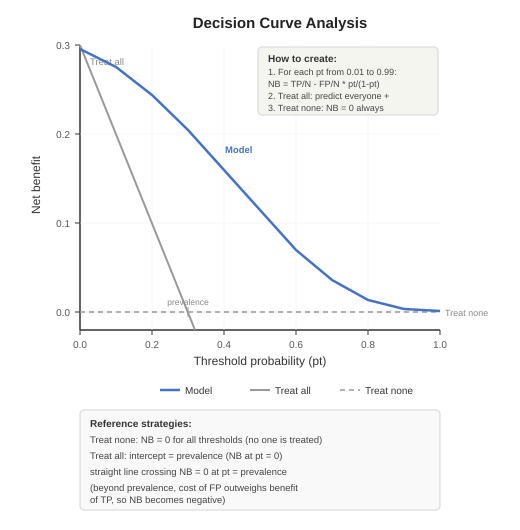

# Evaluating Machine Learning (ML) Prediction Models (cont.)

**Herdiantri Sufriyana**
Graduate Institute of Artificial Intelligence and Big Data in Healthcare
National Taiwan University of Nursing and Health Sciences

---

## Subtopics

- Evaluating discrimination using ROC and precision-recall curves
- Evaluating clinical utility using decision curve analysis

---

## Session 1: Lecture — Discrimination (25 mins)

---

## What is Discrimination?

Discrimination is the model's ability to **separate** patients with and without the outcome across **all possible thresholds**.

**Threshold-independent metrics:**

| Metric | What it measures |
|--------|-----------------|
| **AUC-ROC** | Area under the receiver operating characteristic curve — overall separation |
| **AUC-PRC** | Area under the precision-recall curve — useful for imbalanced data |

**ROC curve:** plots sensitivity (y) vs. 1 − specificity (x) at every threshold — now you know what these mean from Meeting 12 Session 5.

**PRC curve:** plots precision/PPV (y) vs. recall/sensitivity (x) at every threshold.

---

## ROC Curve

---

## Precision-Recall Curve

---

## Session 2: Hands-on — Discrimination (25 mins)

**Task:** Compare discrimination ability of all models using ROC analysis, and locate your cost-aware threshold on the curve.

**Steps:**
1. Connect **Test and Score → ROC Analysis** (label it "ROC curve") via **Evaluation Results → Evaluation Results**
2. In the ROC curve widget, view the ROC curves for all algorithms
3. Compare AUC values — identify the best-discriminating model
4. Note which algorithms have curves close to the diagonal (poor) vs. upper-left corner (good)
5. Click on the ROC curve to move the threshold point to your cost-aware $p_t$ from Meeting 12 Session 4 — note the sensitivity and specificity
6. Compare to Youden's J (the point farthest from the diagonal) — is your cost-aware threshold higher or lower? Why?

**Orange environment** — Continuing from Meeting 12 workflow

---

## Session 3: Lecture — Clinical Utility (30 mins)

---

## What is Clinical Utility?

Clinical utility measures whether using the model **improves clinical decisions** compared to treating all or treating none.

**Decision curve analysis (DCA):**
- Plots **net benefit** against a range of **threshold probabilities**
- Net benefit = true positives (weighted) minus false positives (weighted by threshold)

$$\text{Net benefit} = \frac{TP}{N} - \frac{FP}{N} \cdot \frac{p_t}{1 - p_t}$$

Where $p_t$ = threshold probability (the probability above which you would treat). Now you know what TP and FP mean from Meeting 12 Session 5.

**Interpretation:**
- Compare the model's net benefit curve to two reference strategies:
  - **Treat all** = assume everyone is positive
  - **Treat none** = assume everyone is negative (net benefit = 0)
- A useful model has net benefit **above both references** across clinically relevant thresholds

**Determining the reference strategies:**

| Strategy | Intercept (at $p_t$ = 0) | Slope | Reaches NB = 0 at |
|----------|-------------------------|-------|-------------------|
| **Treat none** | NB = 0 always | Flat (horizontal line at 0) | Always at 0 |
| **Treat all** | NB = prevalence | Decreases as $p_t$ increases | $p_t$ = prevalence |

- **Treat none:** No one is treated → TP = 0, FP = 0 → NB = 0 for every threshold
- **Treat all:** Everyone is predicted positive → TP = all positives, FP = all negatives. At $p_t$ = 0, NB = prevalence (the event rate). As $p_t$ increases, the cost of false positives grows, and NB decreases. NB crosses 0 when $p_t$ equals the prevalence — beyond this, treating everyone costs more than it benefits

> **Can you guess:**
>
> - At which threshold probability does "treat all" have net benefit = 0?
> - Why is a model with AUC = 0.90 not necessarily clinically useful?
> - *(Hint: if the model's net benefit never exceeds "treat all," the model does not add value for decision-making)*

---

## Decision Curve

---

## Session 4: Hands-on — Build Parallel Chain for Treat All and Treat None (35 mins)

**Task:** Add treat-all and treat-none reference models alongside the 7 trained models.

**Steps:**
1. Drag a **Formula** widget (label it "Add treat-all and treat-none") — add two constant columns:
   - `Treat all := 1.0`
   - `Treat none := 0.0`
2. Copy and paste the widgets from Meeting 12 Sessions 6–7 as a parallel path with "(1)" suffix. Connect them in the same order:
   **Add treat-all and treat-none → Predicted probabilities (1) → Stack models (1) → Compute predictions (1) → Predictions (1)**, and **Convert outcome** (from Meeting 12 Session 7) **→ Add outcome (1)** via **Data → Extra Data**, **Predictions (1) → Add outcome (1)** via **Selected Data → Data**
3. Connect **Add outcome** (from Meeting 12 Session 7) and **Add outcome (1)** → **Concatenate** (label it "Concatenate model and treat") via **Data → Additional Data** — this combines the 7-model rows with the 2-reference rows

**Orange environment** — Continuing from Session 2

---

## Session 5: Hands-on — Compute Net Benefits (35 mins)

**Task:** Compute net benefits and compare clinical utility across all models.

**Steps:**
1. Connect **Concatenate model and treat → Formula** (label it "Compute confusion matrix (1)") — same formulas as Meeting 12 Session 8 step 1
2. Connect **Compute confusion matrix (1) → Group By** (label it "Group by model (1)") — same settings as Meeting 12 Session 8 step 2
3. Connect **Group by model (1) → Formula** (label it "Compute n") — compute:
   `n := TP + FP + FN + TN`
4. Connect **Compute n → Formula** (label it "Compute net benefits") — compute (replace 0.21 with your threshold):
   `nb := TP / n - FP / n * 0.21 / (1 - 0.21)`
5. Connect **Compute net benefits → Data Table** (label it "Net benefits") — compare `nb` across all 9 rows
6. For each model, check whether its `nb` > Treat all's `nb` and > Treat none's `nb` (= 0) — a model is clinically useful only when it exceeds both

**Connect to your capstone study plan:**
This analysis informs the "model evaluation" section. Students should take notes of any changes from the study plan in the assignment.

**Orange environment** — Continuing from Session 4

---

## Take-home Message

1. **Discrimination** measures separation ability across all thresholds — use AUC-ROC (sensitivity vs. 1-specificity) and AUC-PRC (precision vs. recall)
2. **Clinical utility** measures whether the model improves decisions — use decision curve analysis (net benefit from TP and FP) to compare against treat-all and treat-none strategies
