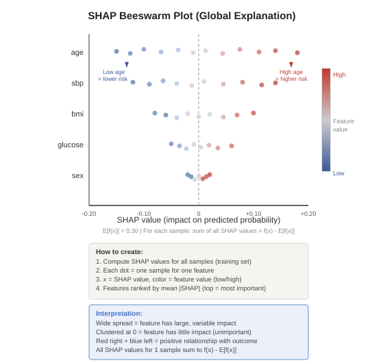
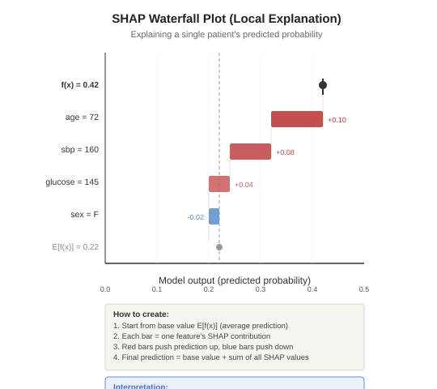

# Explainability, Fairness, Deployment, and Post-Deployment for ML Prediction Models

**Herdiantri Sufriyana**
Graduate Institute of Artificial Intelligence and Big Data in Healthcare
National Taiwan University of Nursing and Health Sciences

---

## Subtopics

- Global explainability using SHAP beeswarm plot
- Error analysis using local explainability (SHAP waterfall plot)
- Assessing fairness using subgroup analysis
- Test set evaluation
- Deployment and post-deployment planning

---

## Session 1: Lecture — Why Explainability and SHAP Theory (15 mins)

---

## Why Explainability?

Even if a model performs well, clinicians and patients need to understand **why** it makes its predictions.

- **Trust:** Clinicians will not use a model they cannot explain
- **Debugging:** Understanding the model reveals data problems and shortcut learning
- **Regulation:** PROBAST+AI and clinical guidelines increasingly require transparency

**Two levels of explanation:**

| Level | What it explains | Example |
|-------|-----------------|---------|
| **Global** | Overall model behavior — which features matter most across all patients | SHAP beeswarm plot |
| **Local** | A single prediction — why this specific patient was predicted positive | SHAP waterfall plot |

> **Can you guess:**
>
> - From Meeting 09, which algorithms are inherently interpretable?
> - Which algorithms are "black boxes" that require post-hoc explanation?
> - *(Hint: logistic regression coefficients are directly interpretable; neural networks are not)*

---

## What is SHAP?

**SHAP (SHapley Additive exPlanations)** uses game theory to assign each feature a contribution to the prediction.

- Based on **Shapley values** from cooperative game theory
- For each prediction, SHAP computes how much each feature **pushed** the prediction away from the average

**Key properties:**
- **Additivity:** SHAP values for all features sum to the difference between the prediction and the average prediction
- **Consistency:** If a feature contributes more in model A than model B, its SHAP value is higher in A
- **Model-agnostic:** Works with any ML algorithm (different explainer types for efficiency)

**SHAP explainer types in the course code:**

| Explainer | Used for | Speed |
|-----------|----------|-------|
| `LinearExplainer` | Logistic/linear regression | Fast |
| `TreeExplainer` | Decision tree, random forest, gradient boosting | Fast |
| `KernelExplainer` | Naive Bayes, KNN, SVM, neural networks | Slow |
| `DeepExplainer` | PyTorch deep neural networks | Medium |

> **Can you guess:**
>
> - Why does `TreeExplainer` work faster than `KernelExplainer`?
> - *(Hint: tree-based models have a structure that allows exact Shapley value computation; kernel-based must approximate using sampling)*

---

## Session 2: Lecture — Global Explainability (10 mins)

---

## SHAP Beeswarm Plot (Global Explanation)

The **beeswarm plot** shows the distribution of SHAP values for each feature across all samples.

> **Can you guess:**
>
> - If a feature has all dots clustered near SHAP = 0, is it important?
> - If a feature has high values (red) on both sides, what does that mean?
> - *(Hint: nonlinear or interaction effect — the feature's impact depends on other features)*

---

## Session 3: Hands-on — Global Explainability (15 mins)

**Task:** Create a SHAP beeswarm plot for the best model.

**Prerequisite:** Install the **Explain** add-on via **Options → Add-ons → search "Explain" → install**, then restart Orange.

**Steps:**
1. Open the Meeting 13 Orange workflow
2. Connect the **best model's learner** (from Meeting 11) **→ Explain Model** (label it "SHAP beeswarm plot") via **Learner → Model**, and connect **Development set** (from Meeting 11) **→ SHAP beeswarm plot** via **Data → Data**
3. In the SHAP beeswarm plot widget, set **Target class** to the positive class (e.g., "1")
4. View feature importance rankings — identify which features are most important for the best model
5. Note the direction of each feature's effect: does a high feature value (red) push the prediction up or down?

**Orange environment** — Continuing from Meeting 13 workflow

---

## Session 4: Lecture — Local Explainability and Error Analysis (10 mins)

---

## SHAP Waterfall Plot (Local Explanation)

The **waterfall plot** explains a **single prediction** — why the model predicted a specific probability for one patient.

**Use cases:**
- **Representative samples:** Select patients with the highest and lowest predicted probabilities to illustrate typical explanations
- **Error analysis:** Select misclassified patients to understand what went wrong

> **Can you guess:**
>
> - Which patient would you select to show the most extreme explanation?
> - If a misclassified patient has a feature with an unexpectedly large SHAP value, what might this indicate?
> - *(Hint: the model may have learned a spurious pattern, or the feature value may be an outlier)*

---

## What is Error Analysis?

**Error analysis** investigates **why the model makes mistakes** — systematically examining misclassified samples.

**Steps:**

1. **Classify errors:** Using the best model and optimal threshold, identify false positives (FP) and false negatives (FN)
2. **Profile errors:** Compare the feature distributions of FP, FN, TP, and TN groups
3. **Explain errors:** Use SHAP waterfall plots for representative misclassified samples
4. **Diagnose patterns:** Are errors concentrated in a specific subgroup? Are errors caused by a specific feature?

**Common error patterns:**
- **Boundary cases:** Predicted probabilities near the threshold — model is uncertain
- **Subgroup bias:** Errors concentrated in an underrepresented subgroup
- **Feature artifacts:** A feature with errors caused by outliers, coding errors, or missing patterns

> **Can you guess:**
>
> - From Meeting 05 (outlier handling), could a missed outlier cause a false positive?
> - How would you use the SHAP waterfall plot to distinguish between a boundary case and a feature artifact?

---

## Session 5: Hands-on — Error Analysis Using Local Explainability (15 mins)

**Task:** Filter misclassified samples and inspect their SHAP waterfall plots.

**Steps:**
1. Connect **Add outcome** (from Meeting 12 Session 7) **→ Select Rows** (label it "Filter FP for the best model") — filter rows where `item` is equal to the best model name, `prediction` is equal to `1`, and `observation` is equal to `0`
2. Connect **Filter FP for the best model → Data Table** (label it "FPs for the best model") — view the false positive samples and note the `id` of one sample (e.g., "ID001")
3. Connect **Development set → Select Rows** (label it "Selected FP for the best model") via **Selected Data → Data** — filter where `id` equals the noted ID (e.g., "ID001"). This retrieves the original features for that sample (since the Melt pipeline lost them)
4. Connect the **best model's learner → Explain Prediction** (label it "SHAP waterfall plot") via **Learner → Model**, and connect **Selected FP for the best model → SHAP waterfall plot** via **Matching Data → Data**
5. In the SHAP waterfall plot widget, set **Target class** to the positive class — view the feature contributions for that single sample to understand why the model made the error. Note: Orange displays the waterfall vertically rather than horizontally
6. Repeat for other FP samples by changing the `id` in "Selected FP for the best model" — note which features consistently drive false positives
7. Change the filter to false negatives: `prediction` == `0` and `observation` == `1` (keep the model name filter), then pick an FN sample's `id` and inspect
8. Compare: are false negatives driven by different features than false positives?

**Orange environment** — Continuing from Session 3

---

## Session 6: Lecture — Fairness (10 mins)

---

## What is Fairness?

**Fairness** means the model performs comparably across **subgroups** (e.g., sex, age groups, ethnicity).

- A model that is accurate overall but performs much worse for a subgroup is **unfair**
- Fairness does not mean equal predictions — it means equal **performance**

**How to assess fairness in this course:**

1. Define **subgroups** from categorical features (e.g., sex = male vs. female)
2. Evaluate the **best model** on each subgroup separately
3. Compare metrics (AUC, sensitivity, specificity) across subgroups

**Unfairness arises from:**
- Imbalanced subgroup representation in training data
- Features that are proxies for protected attributes
- Measurement differences across subgroups

**What to do when unfairness is detected:**
- Report subgroup-specific performance alongside overall performance
- Consider whether the model should be used differently for underperforming subgroups
- Investigate whether more data or subgroup-specific features could help

> **Can you guess:**
>
> - If your dataset has 90% female patients, will the model be fair to male patients?
> - From Meeting 08 (dimensional reduction), how might ontology-based feature grouping reduce proxy bias?

---

## Session 7: Hands-on — Fairness Using Subgroup Analysis (15 mins)

**Task:** Assess whether the best model performs fairly across subgroups.

**Steps:**
1. Connect **Threshold → Select Rows** (label it "Filter best model") via **Data → Data** — filter rows where `item` is equal to the best model name
2. Connect **Filter best model → Merge Data** (label it "Add subgroup") via **Data → Data** — connect **Outcomes** (from Meeting 12 Session 7) via **Data → Extra Data**, match `id` ↔ `id`. This adds the original features (including categorical variables for subgroups) back to the filtered data
3. Connect **Add subgroup → Select Columns** (label it "Select a protected attribute with prediction and observation") — move one protected attribute (e.g., sex) to Features alongside `prediction` and `observation`, move others to Ignored
4. Connect **Select a protected attribute with prediction and observation → Discretize** (label it "Discretize a numerical protected attribute") — if the protected attribute is numerical (e.g., age), discretize it into categories. If already categorical (e.g., sex), this step passes through unchanged
5. Connect **Discretize a numerical protected attribute → Formula** (label it "Compute confusion matrix (2)") — same formulas as Meeting 12 Session 8 step 1 (copy of Compute confusion matrix)
6. Connect **Compute confusion matrix (2) → Group By** (label it "Group by a categorical protected attribute") — group by the protected attribute (e.g., sex), compute: sum of TP, sum of FP, sum of FN, sum of TN
7. Connect **Group by a categorical protected attribute → Formula** (label it "Compute discrimination metrics (1)") — same formulas as Meeting 12 Session 8 step 3 (copy of Compute discrimination metrics)
8. Connect **Compute discrimination metrics (1) → Data Table** (label it "Confusion matrix (1)") — compare metrics across subgroups
9. Note large differences in sensitivity or specificity between subgroups — these indicate potential unfairness

**Orange environment** — Continuing from Session 5

---

## Session 8: Lecture — Test Set Evaluation (10 mins)

---

## Why Evaluate on the Test Set?

In Meetings 11–12, all evaluation used **cross-validation on the development set**. This estimates performance but may be optimistic. The **test set** was held out since Meeting 03 and never touched — it provides an unbiased estimate of real-world performance.

**Steps for test set evaluation:**
1. Select the **best model** based on cross-validation results (calibration, discrimination, clinical utility)
2. Train the best model on the **entire development set**
3. Predict on the **test set**
4. Compute the confusion matrix and discrimination metrics at the cost-aware threshold
5. Compare test set performance to cross-validation performance — large drops indicate overfitting

> **Can you guess:**
>
> - Why must the test set be evaluated only once, at the very end?
> - If test set AUC is much lower than cross-validation AUC, what does that indicate?
> - *(Hint: the model may have overfit to the development set — revisit Meeting 10 on sample size)*

---

## Session 9: Hands-on — Test Set Evaluation (15 mins)

**Task:** Evaluate the best model on the held-out test set.

**Steps:**
1. Connect the **best model's learner → Predictions** via **Learner → Model → Predictors**, and connect **Test set → Predictions** via **Selected Data → Data**
2. Copy the pipeline from Meeting 12 Sessions 6–8 as a parallel chain with numbered suffixes. Connect them as follows:
   - Connect **Predictions → Predicted probabilities (2)** via **Selected Predictions → Data** — (copy of Predicted probabilities)
   - Connect **Predicted probabilities (2) → Stack models (2) → Compute predictions (2) → Predictions (2)** — (copies of Stack models, Compute predictions, Predictions)
   - Connect **Predictions → Outcomes (1)** via **Selected Predictions → Data** — (copy of Outcomes)
   - Connect **Outcomes (1) → Convert outcome (1)** — (copy of Convert outcome)
   - Connect **Predictions (2) → Add outcome (2)** via **Selected Data → Data**, and connect **Convert outcome (1) → Add outcome (2)** via **Data → Extra Data** — (copy of Add outcome)
3. Continue the chain with copies:
   - Connect **Add outcome (2) → Compute confusion matrix (3) → Group by model (2) → Compute discrimination metrics (2) → Confusion matrix (2)** — (copies of Compute confusion matrix, Group by model, Compute discrimination metrics, Confusion matrix)
4. In **Confusion matrix (2)**, read TP, FP, FN, TN, sensitivity, specificity, precision, npv, f1, mcc
5. Compare test set metrics in **Confusion matrix (2)** to the cross-validation metrics in **Confusion matrix** — note any drops in performance
6. Update your capstone study plan with the final test set evaluation metrics

**Connect to your capstone study plan:**
This analysis completes the "model evaluation" section. Students should update the study plan with actual evaluation metrics.

**Orange environment** — Continuing from Session 7

---

## Session 10: Lecture — Deployment (10 mins)

---

## What is Deployment?

**Deployment** means integrating the prediction model into a real-world clinical workflow so that it can be used for actual patient care decisions.

**Key deployment questions:**

| Question | Example |
|----------|---------|
| **Who** uses the model? | Primary care physicians, nurses, screening programs |
| **When** is the prediction made? | At admission, during triage, at annual checkup |
| **How** is the prediction delivered? | Nomogram, EHR alert, mobile app, risk score card |
| **What action** follows the prediction? | Referral, additional testing, closer monitoring |

**Nomogram:**
- A visual tool that allows clinicians to compute a patient's predicted probability by hand, without software
- Traditional nomograms only work with logistic regression (linear coefficients map directly to points)
- **rmlnomogram** (Sufriyana & Su, MEDINFO 2025) extends nomograms to **any ML algorithm** by using all possible predictor combinations and optionally incorporating SHAP values for explainability

**rmlnomogram creates 5 types of nomograms:**

| Type | Predictors | Outcome | Probability | Max predictors |
|------|-----------|---------|-------------|----------------|
| 1 | Categorical only | Binary | No | 15 |
| 2 | Categorical only | Binary | Yes | 5 |
| 3 | Categorical only | Continuous | — | 5 |
| 4 | Categorical + 1 numerical | Binary | Yes | 5 |
| 5 | Categorical + 1 numerical | Continuous | — | 5 |

**How it works:**
1. Generate all possible combinations of predictor values (cross-product of all levels)
2. Predict the model output for each combination
3. Optionally compute SHAP values for each predictor per combination
4. The nomogram visualizes predictions and explainability across all combinations

**Web application:** [https://rmlnomogram.predme.app/](https://rmlnomogram.predme.app/) — upload CSV files and generate nomograms without coding

> Sufriyana H, Su EC. Development of Rmlnomogram: An R Package to Construct an Explainable Nomogram for Any Machine Learning Algorithms. Stud Health Technol Inform. 2025;329:500-504. doi:10.3233/SHTI250890

**Deployment considerations:**
- **Clinical workflow integration:** The model must fit into existing processes — if it requires extra data entry, it will not be used
- **Threshold communication:** Clinicians need to understand what the threshold means and what actions to take above/below it
- **Documentation:** Model card describing intended population, predictors, performance, and limitations

> **Can you guess:**
>
> - Why might a highly accurate model fail in deployment?
> - *(Hint: if the model requires predictors not routinely collected, or if clinicians do not trust or understand it, it will not be used)*

---

## Session 11: Hands-on — Nomogram Using rmlnomogram (10 mins)

**Task:** Create a nomogram using the rmlnomogram web app with example files.

**Steps:**
1. Go to [https://rmlnomogram.predme.app/](https://rmlnomogram.predme.app/)
2. Download the example files from the web app:
   - **Sample features** — all possible combinations of predictor values
   - **Feature categories** — two-column CSV listing features and their categories (prevents categorical predictors from being misidentified as numerical)
   - **Sample output** — single-column CSV with model predictions (header: "output")
   - **Feature explainability** (optional) — SHAP values per predictor
3. Open the example CSVs to understand the required format for each file
4. Upload the example files:
   - Browse and upload **Sample features**
   - Browse and upload **Feature categories**
   - Browse and upload **Sample output**
   - Select **Outcome type**: "Binary or class-wise multinomial"
   - Optionally upload **Feature explainability**
5. View the generated nomogram — note how each predictor value maps to the prediction and how SHAP values show explainability
6. Discuss: how would a clinician use this nomogram at the bedside without software?

**Orange environment** — No Orange widgets needed; nomogram created via rmlnomogram web app

---

## Session 12: Lecture — Post-Deployment Monitoring (10 mins)

---

## What is Post-Deployment Monitoring?

After deployment, model performance can **degrade over time** — this is called **model drift**.

**Types of drift:**

| Type | What changes | Example |
|------|-------------|---------|
| **Data drift** | Distribution of input features changes | New patient demographics, different lab equipment |
| **Concept drift** | Relationship between features and outcome changes | New treatment guidelines change who becomes inpatient |
| **Label drift** | Distribution of outcomes changes | Disease prevalence increases or decreases |

**Post-deployment monitoring plan:**

1. **Performance tracking:** Periodically re-evaluate calibration, discrimination, and clinical utility on new data
2. **Trigger criteria:** Define when to recalibrate or retrain — e.g., calibration slope deviates from 1 by more than 0.2, or AUC drops by more than 0.05
3. **Recalibration:** Update the model intercept (and optionally slope) using new data, without full retraining
4. **Retraining:** Rebuild the model from scratch when recalibration is insufficient
5. **Adverse event reporting:** Document and investigate cases where the model's prediction led to clinical harm

> **Can you guess:**
>
> - If a hospital changes its lab equipment, which type of drift would occur?
> - Why is recalibration preferred over retraining as a first step?
> - *(Hint: recalibration preserves the original model structure and requires less data; retraining requires repeating the entire development process)*

---

## Session 13: Hands-on — Deployment and Post-Deployment Planning (5 mins)

**Task:** Draft a deployment and post-deployment plan for your capstone project.

**Steps:**
1. Answer the deployment questions for your best model:
   - **Who** will use this model? (target clinical users)
   - **When** will the prediction be made? (time point in clinical workflow)
   - **How** will the prediction be delivered? (nomogram from rmlnomogram, EHR alert, risk card)
   - **What action** follows a positive/negative prediction?
2. Draft a post-deployment monitoring plan:
   - How often will performance be re-evaluated?
   - What metrics will be tracked? (calibration slope, AUC, sensitivity at cost-aware threshold)
   - What are the trigger criteria for recalibration or retraining?
3. Update your capstone study plan with the deployment and post-deployment sections

**Connect to your capstone study plan:**
This completes the "deployment and post-deployment" section. Students should update the study plan with their deployment and monitoring plan.

**Orange environment** — No Orange widgets needed; this is a planning exercise

---

## Take-home Message

1. **Global explainability** via SHAP beeswarm plot reveals which features matter most and in which direction — essential for trust and debugging
2. **Local explainability** via SHAP waterfall plot explains individual predictions — use it for error analysis to understand why the model misclassified specific patients
3. **Error analysis** systematically investigates false positives and false negatives to identify boundary cases, subgroup bias, and feature artifacts
4. **Fairness** requires evaluating performance across subgroups — large performance gaps indicate potential bias that should be reported and addressed
5. **Test set evaluation** provides an unbiased estimate of real-world performance — compare to cross-validation results to detect overfitting
6. **Deployment** requires answering who, when, how, and what action — use rmlnomogram to create a nomogram for any ML algorithm, enabling clinicians to use the model without software
7. **Post-deployment monitoring** detects model drift — define trigger criteria for recalibration or retraining, and report adverse events
